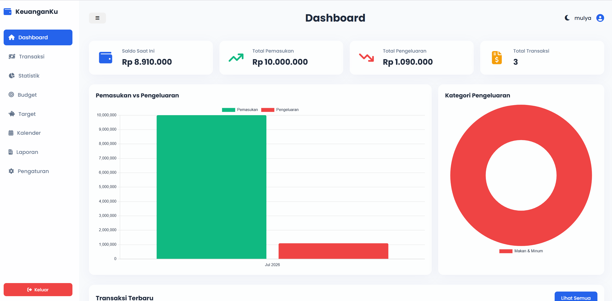
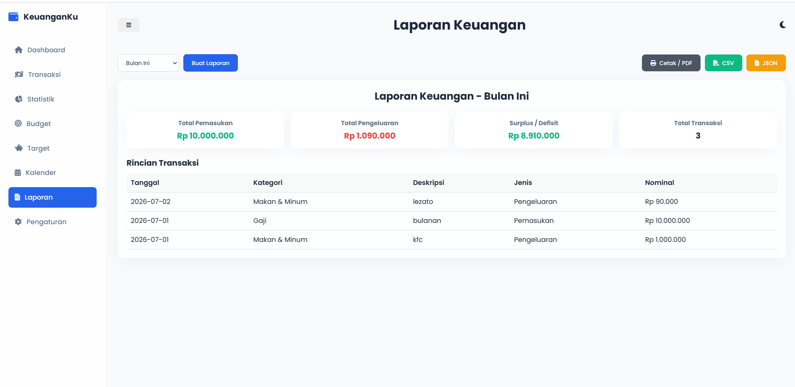

# 🚀 Manajemen Keuangan - Personal Finance Tracker


Manajemen Keuangan adalah aplikasi pencatatan dan analisis keuangan pribadi yang dirancang agar ringan, cepat, dan sepenuhnya berjalan di sisi klien (*client-side*). Dibangun dengan antarmuka **Glassmorphism** yang elegan, aplikasi ini memastikan pengalaman pengguna yang modern dan responsif tanpa memerlukan server backend atau database eksternal. Seluruh data Anda disimpan secara aman di dalam browser melalui **Local Storage**.

---

## 📸 Cuplikan Layar (Screenshots)
*(Di bawah ini adalah gambaran halaman utama aplikasi)*

| Halaman Login | Dashboard Analisis | Laporan aktivitas |
| :---: | :---: |
|  |   |

---

## ✨ Fitur Utama

### 📊 Dashboard & Statistik Interaktif
* **Ringkasan Real-time:** Pantau total pemasukan, pengeluaran, sisa saldo, dan total transaksi secara langsung.
* **Grafik Visual (Chart.js):** Dilengkapi dengan *Bar Chart* untuk perbandingan uang masuk vs keluar, serta *Pie Chart* untuk melacak kategori pengeluaran terbesar.
* **Analisis Cerdas:** Menghitung rata-rata pengeluaran harian dan menampilkan transaksi terbaru.

### 💸 Manajemen Transaksi (CRUD)
* **Pencatatan Fleksibel:** Tambahkan transaksi Pemasukan atau Pengeluaran dengan form yang interaktif dan kategori yang dinamis.
* **Filter & Pencarian:** Temukan transaksi spesifik berdasarkan rentang waktu, jenis, pencarian teks, atau urutkan dari nominal terbesar/terkecil.
* **Format Otomatis:** Input nominal secara otomatis diubah menjadi format mata uang Rupiah.

### 🎯 Budget & Target Tabungan
* **Batas Pengeluaran (Budgeting):** Atur budget bulanan untuk setiap kategori (Makan, Transportasi, dll) dengan indikator persentase dinamis (Hijau, Kuning, Merah).
* **Target Keuangan:** Buat target seperti "Beli Laptop" atau "Dana Darurat". Pantau progres tabungan beserta sisa hari (deadline) untuk memotivasi Anda.

### 📅 Kalender & Laporan Eksekutif
* **Kalender Keuangan:** Lihat hari apa saja Anda melakukan transaksi langsung dari tampilan kalender bulan demi bulan.
* **Ekspor Laporan:** Buat laporan harian, mingguan, bulanan, atau tahunan lalu **Export ke CSV, JSON, atau Cetak (PDF)** langsung dari browser.
* **Backup & Restore:** Fitur perlindungan data di menu Pengaturan yang memungkinkan Anda mengunduh seluruh data (Backup JSON) dan memulihkannya (Restore) ke perangkat lain.

---

## 🛠️ Teknologi yang Digunakan

* **Logika Aplikasi:** Vanilla JavaScript (ES6+)
* **Penyimpanan:** Local Storage API (Client-side NoSQL)
* **Frontend:** HTML5 & Vanilla CSS3
* **Visual & Grafis:** Chart.js (Grafik Data) & FontAwesome (Ikon)
* **Desain UI/UX:** Tema *Glassmorphism*, dukungan **Dark Mode** & **Light Mode**, serta efek *hover* modern.

---

## 💻 Cara Instalasi & Menjalankan (Local Development)

Proyek ini tidak memerlukan instalasi backend kompleks (seperti PHP/Node.js/MySQL) karena seluruhnya berbasis sisi-klien (*client-side*).

### 1. Menjalankan Aplikasi dengan Script
Jika Anda menggunakan Windows dan telah menginstal **Python**, kami telah menyediakan *script wrapper* yang sangat ringan agar Anda tidak perlu membuka file HTML secara manual satu per satu:

1. Buka folder kerja proyek ini.
2. Klik ganda pada file `run.bat` (Atau buka terminal dan jalankan `run.bat`).
3. Server lokal akan aktif. Buka browser Anda dan kunjungi: 
   ```text
   http://localhost:8000
   ```

### 2. Menjalankan Melalui VS Code (Alternatif)
Jika Anda menggunakan Visual Studio Code, Anda bisa menginstal ekstensi **Live Server**:
1. Buka folder proyek di dalam VS Code.
2. Klik kanan pada file `index.html` dan pilih **Open with Live Server**.

> **Catatan Keamanan:** Aplikasi ini bekerja secara independen di browser Anda. Seluruh data transaksi, pengaturan, dan target disimpan secara eksklusif dalam *Local Storage* komputer Anda. Jika Anda ingin pindah perangkat/browser, pastikan untuk menekan tombol **Download Backup** terlebih dahulu di menu Pengaturan.
# laporan-keuangan
